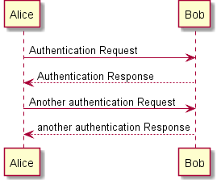
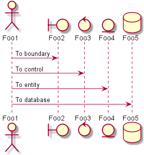
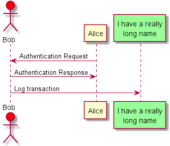
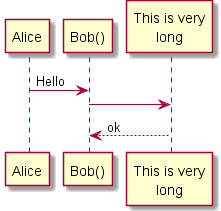
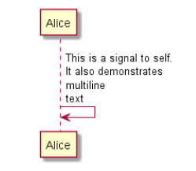

##1.顺序图

###1.1 简单示例
在PlantUML中参与者不用明确地定义, 我们使用序列符号"->" 来绘制两个参与者之间的消息.
> 如果想绘制虚线可以使用 "- ->"
> 同样的可以使用 "<-" 与 "<- -" 来改善可读性.

代码清单1.1

	@startuml
	Alice -> Bob: Authentication Request
	Bob --> Alice: Authentication Response
	Alice -> Bob: Another authentication Request
	Alice <-- Bob: another authentication Response
	@enduml



###1.2 注释
在PlantUML中所有以符号 `'` 开头的都是注释.
多行注释采用 `/'` 开始  `'/` 结尾的形式.

###1.3 定义参与者
我们可以使用关键字来改变参与者，并且可以使用其他的关键字来定义参与者。

- actor
- boundary
- control
- entity
- database

代码清单1.3_1

	@startuml
	actor Foo1
	boundary Foo2
	control Foo3
	entity Foo4
	database Foo5
	Foo1 -> Foo2 : To boundary
	Foo1 -> Foo3 : To control
	Foo1 -> Foo4 : To entity
	Foo1 -> Foo5 : To database
	@enduml



你还可以使用关键字重命名参与者，同样你可以修改参与者的背景颜色.

代码清单1.3_2

	@startuml
	actor Bob #red
	' The only difference between actor
	'and participant is the drawing
	participant Alice
	participant "I have a really\nlong name" as L #99FF99
	/' You can also declare:
	participant L as "I have a really\nlong name" #99FF99
	'/
	Alice ->Bob: Authentication Request
	Bob ->Alice: Authentication Response
	Bob ->L: Log transaction
	@enduml




###1.4 使用非字母定义参与者
你可以使用引号来定义一个参与者，还可以使用关键字给参与者定义别名.

代码清单1.4

	@startuml
	Alice -> "Bob()" : Hello
	"Bob()" -> "This is very\nlong" as Long
	' You can also declare:
	' "Bob()" -> Long as "This is very\nlong"
	Long --> "Bob()" : ok
	@enduml
    
    


###1.5 自我发送消息
参与者可以给自己发送消息，可以使用 \n 来使消息折行.

	@startuml
	Alice ->Alice: This is a signal to self.\nIt also demonstrates\nmultiline \ntext
	@enduml


###1.6 改变箭头形状
你可以使用如下的方式改变箭头形状:
1. 使用 x 指向丢失的消息
2. 使用 \ 或者 / 代替 < 或者 > 来显示箭头的上面或者下面部分
3. 使用 >> 或者 // 绘制实心箭头
4. 使用 -- 代替 - 绘制虚箭头
5. 增加 o 在箭头头上
6. 使用双方向箭头


	@startuml
	Bob ->x Alice
	Bob -> Alice
	Bob ->> Alice
	Bob -\ Alice
	Bob \\- Alice
	Bob //-- Alice
	Bob ->o Alice
	Bob o\\-- Alice
	Bob <-> Alice
	Bob <->o Alice
	@enduml


###1.7 改变箭头颜色
你可以使用如下符号改变箭头颜色

	@startuml
	Bob -[#red]> Alice : hello
	Alice -[#0000FF]->Bob : ok
	@enduml
    


###1.8 消息队列号
使用关键字`autonumber` 来给消息加上序列号

	@startuml
	autonumber
	Bob -> Alice : Authentication Request
	Bob <- Alice : Authentication Response
	@enduml


你可以指定一个特殊的起始序列号与序列号间距.
	
    autonumber
	Bob -> Alice : Authentication Request
	Bob <- Alice : Authentication Response
	autonumber 15
	Bob -> Alice : Another authentication Request
	Bob <- Alice : Another authentication Response
	autonumber 40 10
	Bob -> Alice : Yet another authentication Request
	Bob <- Alice : Yet another authentication Response
	@enduml
    
    


你可以使用`[ ]`来格式化你的数字,使用的是java的DecimalFormat来格式化.你还可以使用一些html标签来格式化数字.

	@startuml
	autonumber "<b>[000]"
	Bob -> Alice : Authentication Request
	Bob <- Alice : Authentication Response
	autonumber 15 "<b>(<u>##</u>)"
	Bob -> Alice : Another authentication Request
	Bob <- Alice : Another authentication Response
	autonumber 40 10 "<font color=red ><b>Message 0 "
	Bob -> Alice : Yet another authentication Request
	Bob <- Alice : Yet another authentication Response
	@enduml
    


###1.9 标题
使用关键字`title`来放置一个标题

	@startuml
	title Simple communication example
    Alice -> Bob: Authentication Request
	Bob --> Alice: Authentication Response
	@enduml


###1.10 图标说明
使用关键字`legend`来给图例增加说明，可以放置在左边，中间和右边.
	
    @startuml
	Alice -> Bob : Hello
	legend right
	Short
	legend
	endlegend
	@enduml
    


###1.11 Splitting diagrams
使用关键字`newpage`来把一张图标分割成多个.
你可以在newpage之后放title。这个关键字在打印一个很长的图表时很有用.

	@startuml
	Alice -> Bob : message 1
	Alice -> Bob : message 2
	newpage
	Alice -> Bob : message 3
	Alice -> Bob : message 4
	newpage A title for the\nlast page
	Alice -> Bob : message 5
	Alice -> Bob : message 6
	@enduml


###1.12 分组消息
可以使用下面的关键字来对消息分组
+ alt/else
+ opt
+ loop
+ par
+ break
+ critical
+ group ps:在一个text显示之后

	
    Alice -> Bob: Authentication Request
	alt successful case
	Bob -> Alice: Authentication Accepted
	else some kind of failure
	Bob -> Alice: Authentication Failure
	group My own label
	Alice -> Log : Log attack start
	loop 1000 times
    Alice -> Bob: DNS Attack
	end
	Alice -> Log : Log attack end
	end
	else Another type of failure
	Bob -> Alice: Please repeat
	end
	@enduml


###1.13 消息注释
可以使用关键字`note`来给消息加上注释. 使用·left right ·来放置位置，使用end关键字来换行

	@startuml
	Alice ->Bob : hello
	note left: this is a first note
	Bob ->Alice : ok
	note right: this is another note
	Bob ->Bob : I am thinking
	note left
	a note
	can also be defined
	on several lines
	end note
	@enduml


###1.14 其他注释

	@startuml
	participant Alice
	participant Bob
	note left of Alice #aqua
	This is displayed
	left of Alice.
	end note
	note right of Alice: This is displayed right of Alice.
	note over Alice: This is displayed over Alice.
	note over Alice , Bob #FFAAAA: This is displayed\n over Bob and Alice.
	note over Bob , Alice
	This is yet another
	example of
	a long note.
	end note
	@enduml


###1.15 Creole and HTML
可以使用Creole模板来格式化
```@startuml
participant Alice
participant "The **Famous** Bob" as Bob
Alice -> Bob : hello --there --
... Some ~~long delay~~ ...
Bob -> Alice : ok
note left
This is **bold**
This is //italics//
This is ""monospaced""
This is --stroked --
This is __underlined__
This is ~~waved~~
end note
Alice -> Bob : A //well formatted// message
note right of Alice
This is <back:cadetblue ><size:18>displayed </size ></back >
__left of__ Alice.
end note
note left of Bob
<u:red >This </u> is <color #118888> displayed </color >
**<color purple >left of </color > <s:red >Alice </strike > Bob**.
end note
note over Alice , Bob
<w:#FF33FF >This is hosted </w> by 
end note
@enduml

```


###1.16 分割器
你可以使用 `==` 来对图例进行逻辑分割.

```
@startuml
== Initialization ==
Alice -> Bob: Authentication Request
Bob --> Alice: Authentication Response
== Repetition ==
Alice -> Bob: Another authentication Request
Alice <-- Bob: another authentication Response
@enduml

```


###1.17 引用
使用关键字`ref` 来引用另外一个图例
```
@startuml
participant Alice
actor Bob
ref over Alice , Bob : init
Alice -> Bob : hello
ref over Bob
This can be on
several lines
end ref
@enduml
```


###1.18 延迟
使用关键字`...` 来绘制延迟.
```
@startuml
Alice -> Bob: Authentication Request
...
Bob --> Alice: Authentication Response
...5 minutes latter...
Bob --> Alice: Bye !
@enduml

```


###1.19 空间
使用 |||来让出一部分空间，单位为pix

```
@startuml
Alice -> Bob: message 1
Bob --> Alice: ok
|||
Alice -> Bob: message 2
Bob --> Alice: ok
||45||
Alice -> Bob: message 3
Bob --> Alice: ok
@enduml
PlantUML
```


###1.20 生命线开始与结束
使用关键字`activate`与`deactivate`来表示开始与结束.

```
@startuml
participant User
User -> A: DoWork
activate A
A -> B: << createRequest >>
activate B
B -> C: DoWork
activate C
C --> B: WorkDone
destroy C
B --> A: RequestCreated
deactivate B
A -> User: Done
deactivate A
@enduml

```


还可以给它增加颜色

```
@startuml
participant User
User -> A: DoWork
activate A #FFBBBB
A -> A: Internal call
activate A #DarkSalmon
A -> B: << createRequest >>
activate B
B --> A: RequestCreated
deactivate B
deactivate A
A -> User: Done
deactivate A
@enduml

```


###1.21 参与者创建物
使用关键字`create` 来表达创建一个物体

```
@startuml
Bob -> Alice : hello
create Other
Alice -> Other : new
create control String
Alice -> String
note right : You can also put notes!
Alice --> Bob : ok
@enduml

```


###1.22 进出消息
使用进入和出去的箭头来表达你想关注图例的哪块，使用`[`与`]`来处理

```
@startuml
[-> A: DoWork
activate A
A -> A: Internal call
activate A
A ->] : << createRequest >>
A<--] : RequestCreated
deactivate A
[<- A: Done
deactivate A
@enduml

```


###1.23 模式化
可以使用`<<` 与 `>>` 来模式化参与者

```
@startuml
participant "Famous Bob" as Bob << Generated >>
participant Alice << (C,#ADD1B2) Testable >>
Bob ->Alice: First message
@enduml

```


```
@startuml
participant Bob << (C,#ADD1B2) >>
participant Alice << (C,#ADD1B2) >>
Bob ->Alice: First message
@enduml

```


###1.24 标题附加更多信息
使用creole格式化
```
@startuml
title __Simple__ **communication** example
Alice -> Bob: Authentication Request
Bob -> Alice: Authentication Response
@enduml

```


使用`\n`来分行

```
@startuml
title __Simple__ communication example\non several lines
Alice -> Bob: Authentication Request
Bob -> Alice: Authentication Response
@enduml

```


使用title 与end 来定义多行title
```
@startuml
title
<u>Simple </u> communication example
on <i>several </i> lines and using <font color=red >html </font >
This is hosted by 
end title
Alice -> Bob: Authentication Request
Bob -> Alice: Authentication Response
@enduml

```


###1.25 包围参与者
使用关键字`box` `end`来包围参与者,同样的你可以增加背景色等其他附加属性.
```
@startuml
box "Internal Service" #LightBlue
participant Bob
participant Alice
end box
participant Other
Bob -> Alice : hello
Alice -> Other : hello
@enduml

```


###1.26 移除页脚
使用关键字`footbox`来移除图例的页脚
```
@startuml
hide footbox
title Footer removed
Alice -> Bob: Authentication Request
Bob --> Alice: Authentication Response
@enduml
```


###1.27 皮肤参数
使用关键字`skinparam` 来改变颜色和字体
```
@startuml
skinparam backgroundColor #EEEBDC
skinparam sequence {
ArrowColor DeepSkyBlue
ActorBorderColor DeepSkyBlue
LifeLineBorderColor blue
LifeLineBackgroundColor #A9DCDF
ParticipantBorderColor DeepSkyBlue
ParticipantBackgroundColor DodgerBlue
ParticipantFontName Impact
ParticipantFontSize 17
ParticipantFontColor #A9DCDF
ActorBackgroundColor aqua
ActorFontColor DeepSkyBlue
ActorFontSize 17
ActorFontName Aapex
}
actor User
participant "First Class" as A
participant "Second Class" as B
participant "Last Class" as C
User -> A: DoWork
activate A
A -> B: Create Request

activate B
B -> C: DoWork
activate C
C --> B: WorkDone
destroy C
B --> A: Request Created
deactivate B
A --> User: Done
deactivate A
@enduml

```


