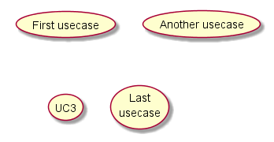
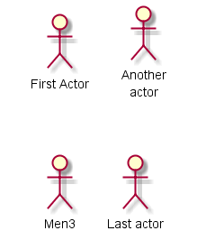

##2.用例图
###2.1 用例
用例的代码表示是将其使用括号括起来(其原因是由于两个括号看起来像椭圆形).
你还可以使用关键字 `usecase` 去定义一个用例. 并且你可以使用关键字 `as` 定义一个别名给这个用例. 
这个别名在被定义后方可使用.

	@startuml

	(First usecase)
	(Another usecase) as (UC2)
	usecase UC3
	usecase (Last\nusecase) as UC4

	@enduml

###2.2 行为者
行为者的代码表示是将其使用冒号括起来
你还可以使用关键字 `actor` 去定义一个行为者. 并且你可以使用关键字 `as` 定义一个别名给这个行为者. 我们将会看到行为者的定义是可选的.

	@startuml

	:First Actor:
	:Another\nactor: as Men2
	actor Men3
	actor :Last actor: as Men4

	@enduml

###2.3 用例描述
如果你想要拥有一个多行描述, 你可以使用引号.
你还可以使用以下分隔符: `--` `..` `==` `__`.并且你可以将标题放在分隔符之间.

	@startuml

	usecase UC1 as "You can use
	several lines to define your usecase.
	You can also use separators.
	--
	Several separators are possible.
	==
	And you can add titles:
	..Conclusion..
	This allows large description."

	@enduml

###2.4 基本例子
使用箭头 `-->` 在行为者与用例间建立连接.
在定义中使用越多的破折号 `-`将使得箭头越长. 你可以在箭头上添加一个标签用来说明, 使用 `:` 内容在箭头上定义.
在本例中, 你可以看到 `User` 在使用前没有被定义, 但是作为一个行为者被使用.

	@startuml

	User -> (Start)
	User --> (Use the application) : A small label
	:Main Admin: ---> (Use the application) : This is\nyet another\nlabel

	@enduml

###2.5 继承
如果一个 行为者(或用例) 继承自另一个行为(或用例), 你可以使用符号 `<|--`(这个符号看起来像  ).

	@startuml

	:Main Admin: as Admin
	(Use the application) as (Use)
	User <|-- Admin
	(Start) <|-- (Use)

	@enduml

###2.6 使用说明
你可以使用关键字 `note left of`, `note right of`, `note top of`, `note button of` 去定义说明一个单一的实体.
一个说明还可以通过定义一个关键字 `note`, 然后通过符号 `..` 去链接另一个实体.

    @startuml

    :Main Admin: as Admin
    (Use the application) as (Use)
    User -> (Start)
    User --> (Use)
    Admin ---> (Use)
    note right of Admin : This is an example.
    note right of (Use)
    A note can also
    be on several lines
    end note
    note "This note is connected\nto several objects." as N2
    (Start) .. N2
    N2 .. (Use)

    @enduml

###2.7 模板
你可以添加模板在定义行为者与用例时, 使用符号 `<<` 和 `>>`.

	@startuml

	User << Human >>
	:Main Database: as MySql << Application >>
	(Start) << One Shot >>
	(Use the application) as (Use) << Main >>
	User -> (Start)
	User --> (Use)
	MySql --> (Use)

	@enduml

###2.8 改变箭头方向
默认情况下,两个类链接使用两个破折号 `--` 表现形式为纵向. 也可以使用表现形式为横向的链接, 放一个单一的破折号(或者一个.)像这样:

	@startuml

	:user: --> (Use case 1)
	:user: -> (Use case 2)

	@enduml

你还可以改变箭头的方向从而改变链接的方向:

	@startuml

	(Use case 1) <.. :user:
	(Use case 2) <- :user:

	@enduml

使用关键字 `left`, `right`, `up` 还有 `down` 改变链接的方向:

	@startuml

	:user: -left-> (dummyLeft)
	:user: -right-> (dummyRight)
	:user: -up-> (dummyUp)
	:user: -down-> (dummyDown)

	@enduml

你可以使用上述关键字的首字母去改变链接的方向(如: `-d-` 去代替 `-down-`) 或者使用关键字的前两个字母(如: `-do-` 去代替 `-down-`).
请注意, 你不应该去滥用这个功能, 因为  *Graphviz* 已经给出了很好的视图组织而无须你另外定义.

###2.9 图标标题
关键字 `title` 用来设置一个标题.
你可以使用关键字 `title` 和 `end title` 来设置一个长标题, 在序列图中.

	@startuml

	title Simple <b>Usecase </b>\nwith one actor
	"Use the application" as (Use)
	User -> (Use)

	@enduml

###2.10 分图
关键字 `newpage` 用来分割你的图标为多个页面或图像.

	@startuml

	:actor1: --> (Usecase1)
	newpage
	:actor2: --> (Usecase2)

	@enduml

###2.11 方向从左到右
一般默认行为为从上到下的方向

	@startuml

	'default
	top to bottom direction
	user1 --> (Usecase 1)
	user2 --> (Usecase 2)

	@enduml

你可以改变 left to right 使用命令 `left to right direction`. 结果往往是这样设置方向更好.

	@startuml
	left to right direction
	user1 --> (Usecase 1)
	user2 --> (Usecase 2)
	@enduml

###2.12 皮肤选项
你可以使用 `skinparam` 命令去修改画布的颜色和字体.
你可以使用命令:
+ 在图形的定义时, 像其他命令一样,
+ 在一个被包含的文件中,
+ 在配置文件中, 在命令行中或ANT任务中.
你可以定义特殊的颜色或字体于模板行为者和用例.

    @startuml

    skinparam usecase {
    BackgroundColor DarkSeaGreen
    BorderColor DarkSlateGray
    BackgroundColor << Main >> YellowGreen
    BorderColor << Main >> YellowGreen
    ArrowColor Olive
    ActorBorderColor black
    ActorFontName Courier
    ActorBackgroundColor << Human >> Gold
    }
    User << Human >>
    :Main Database: as MySql << Application >>
    (Start) << One Shot >>
    (Use the application) as (Use) << Main >>
    User -> (Start)
    User --> (Use)
    MySql --> (Use)

    @enduml

###2.13 结束例程

    @startuml

    left to right direction
    skinparam packageStyle rect
    actor customer
    actor clerk
    rectangle checkout {
    customer -- (checkout)
    (checkout) .> (payment) : include
    (help) .> (checkout) : extends
    (checkout) -- clerk
    }

    @enduml

