##3 类图

###3.1 类之间的关系

类之间关系是用以下符号定义的：

这里可以用 .. 取代 --
知道这些规则以后，我们可以画出以下类图：

	@startuml
	scale 800 width
	Class01 <|-- Class02
	Class03 *-- Class04
	Class05 o-- Class06
	Class07 .. Class08
	Class09 -- Class10
	Class11 <|.. Class12
	Class13 --> Class14
	Class15 ..> Class16
	Class17 ..|> Class18
	Class19 <--* Class20
	@enduml

###3.2 标签上的关系

可以使用 ":" 紧跟在文本后面，来添加一个标签的关系。
对于输出值，你可以在关系的每一侧用双引号“”标出。

    @startuml
    Class01 "1" *-- "many" Class02 : contains
    Class03 o-- Class04 : aggregation
    Class05 --> "1" Class06
    @enduml

你可以添加一个额外的指向对象的箭头用于描述对象作用于其它对象，这可以通过在描述的开头或者结尾加上 < 或者 > 来实现：

    @startuml
    class Car
    Driver - Car : drives >
    Car *- Wheel : have 4 >
    Car -- Person : < owns
    @enduml

###3.3 添加方法

要声明字段和方法，你可以在字段和方法的名字后面添加 ":" :
系统会通过检查括号来区分字段呵方法。

    @startuml
    Object <|-- ArrayList
    Object : equals()
    ArrayList : Object[] elementData
    ArrayList : size()
    @enduml

你还可以组合 "{}" 之间的字段和方法。
注意关于名字和类型的顺序的语法是高度灵活的。

    @startuml
    class Dummy {
    String data
    void methods()
    }
    class Flight {
    flightNumber : Integer
    departureTime : Date
    }
    @enduml

###3.4 定义可见性

当你要定义方法或者字段的可见性时，你可以使用相应的修饰符：

你可以使用 "skinparam classAttributeIconSize 0" 命令来关掉这些功能：

    @startuml
    skinparam classAttributeIconSize 0
    class Dummy {
    -field1
    #field2
    ~method1()
    +method2()
    }
    @enduml

###3.5 抽象和静态

你可以使用静态和抽象修饰符来定义静态或者抽象字段和方法。
这些修饰符可以在开头或者结尾的时候使用。你可以选择使用分器类而不是静态的。

    @startuml
    class Dummy {
    {static} String id
    {abstract} void methods()
    }
    @enduml

###3.6 高级类

默认情况下，方法和字段会由PlantUML自动重组。你可以使用分隔符定义自己字段和方法的排序方式。分隔符可以是： -- .. == __。

你也可以在标题中使用分隔符：

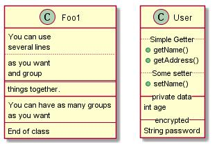

###3.7 注释和Stereotypes

Stereotypes是定义类的关键词，用"<<" 和 ">>"。
你还可以使用左注释、右注释、顶部注释和底部注释定义关键字。
你还可以在上一个类的左边、右边、顶部、底部贴上注释。
注释也可以用关键字单独定义，然后用 ".." 符号链接其它对象使用。

    @startuml
    class Object << general >>
    Object <|--- ArrayList
    note top of Object : In java, every class\nextends this one.
    note "This is a floating note" as N1
    note "This note is connected\nto several objects." as N2
    Object .. N2
    N2 .. ArrayList
    class Foo
    note left: On last defined class
    @enduml

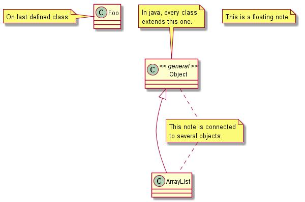

###3.8 更多注释

也可以使用一些HTML标签，如：

    • <b >
    • <u >
    • <i >
    • <s >, <del >, <strike >
    •  or 
    • <color:AAAAAA > or <color:colorName >
    • <size:nn > to change font size
    •  or  : the file must be accessible by the filesystem

你也可以针对多行代码写一个注释。你也可以给最新定义的类加上一个注释，可以使用左边注释、右边注释、顶部注释和底部注释。

    @startuml
    class Foo
    note left: On last defined class
    note top of Object
    In java, <size:18>every </size> <u>class </u>
    <b>extends </b>
    <i>this</i> one.
    end note
    note as N1
    This note is <u>also</u>
    <b><color:royalBlue >on several </color>
    <s>words </s> lines
    And this is hosted by 
    end note
    @enduml

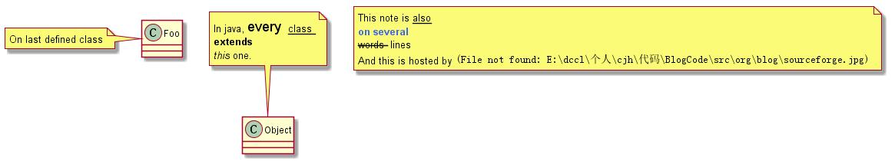

###3.9 链接注释

可以在关系连接线上添加一个注释，在链接定以后使用注释。
你可以在链接的左边、右边、顶部、底部使用注释，如果你想改变注释的相对位置的话。

    @startuml
    class Dummy
    Dummy --> Foo : A link
    note on link #red: note that is red
    Dummy --> Foo2 : Another link
    note right on link #blue
    this is my note on right link
    and in blue
    end note
    @enduml

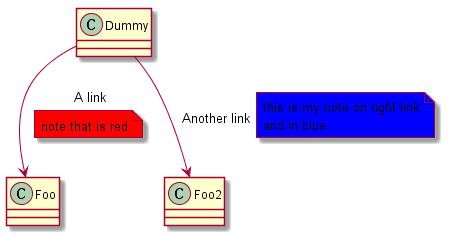

###3.10 抽象类和接口

你可以使用 "abstract" 或者 "abstract class" 关键字来声明一个类为抽象类。
这个类会用斜体表示。
你也可以使用 interface, annotation 和 enum 关键字。

    @startuml
    abstract class AbstractList
    abstract AbstractCollection
    interface List
    interface Collection
    List <|-- AbstractList
    Collection <|-- AbstractCollection
    Collection <|- List
    AbstractCollection <|- AbstractList
    AbstractList <|-- ArrayList
    class ArrayList {
    Object[] elementData
    size()
    }
    enum TimeUnit {
    DAYS
    HOURS
    MINUTES
    }
    annotation SuppressWarnings
    @enduml

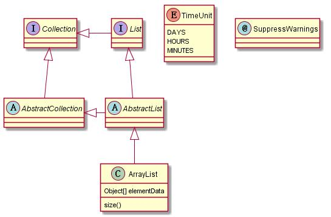

###3.11 使用非字母

如果你想在类中显示非字母，你可以：

	在类的定义中使用 "as" 关键字；
	类名两边加上引号 ""。

    @startuml
    class "This is my class" as class1
    class class2 as "It works this way too"
    class2 *-- "foo/dummy" : use
    @enduml

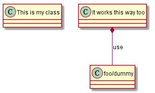

###3.12 隐藏属性、方法

您可以使用隐藏/显示的命令来参数化类的显示。
基本命令：隐藏空的成员。该命令将隐藏属性或方法，如果它们是空的。
而不是空的成员，您可以使用：

	对于空字段使用空字段或者空属性
    对于空方法使用空方法
    成员将隐藏字段和属性，即使它们被描述
    方法将会被隐藏，即使它们被描述了
    成员将隐藏字段和方法,即使他们被描述
    环绕字符前面的类名
    原型的原型

你也可以提供只隐藏或者显示关键字：

    • class for all classes,
    • interface for all interfaces,
    • enum for all enums,
    • <<foo1 >> for classes which are stereotyped with foo1,
    • an existing class name.

你也可以使用几个显示/隐藏命令来定义规则和异常。

    @startuml
    class Dummy1 {
    +myMethods()
    }
    class Dummy2 {
    +hiddenMethod()
    }
    class Dummy3 <<Serializable >> {
    String name
    }
    hide members
    hide <<Serializable >> circle
    show Dummy1 methods
    show <<Serializable >> fields
    @enduml

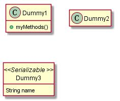

###3.13 隐藏类

你也可以使用显示/隐藏命令来隐藏类。

如果你定义了一个大的包含多个类的文件，你想隐藏其中一个或几个，可以这样：

    @startuml
    class Foo1
    class Foo2
    Foo2 *-- Foo1
    hide Foo2
    @enduml

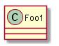

###3.14 使用泛型

你还可以使用括号 < 和 > 定义泛型的使用。

    @startuml
    class Foo<? extends Element > {
    int size()
    }
    Foo *- Element
    @enduml

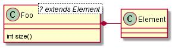

###3.15 具体的点

通常,发现字符(C I,E或)用于类、接口、枚举和抽象类。
但是你可以自己定义一个类的原型，添加一个字符或者一种颜色。像这个例子中：

    @startuml
    class System << (S,#FF7700) Singleton >>
    class Date << (D,orchid) >>
    @enduml

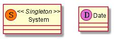

###3.16 包

使用包的关键字，你可以定义一个包并未你的包自定义声明一个背景颜色(使用HTML颜色代码和名字)。
注意包可以嵌套。

@startuml
package "Classic Collections" #DDDDDD {
Object <|-- ArrayList
}
package net.sourceforge.plantuml {
Object <|-- Demo1
Demo1 *- Demo2
}
@enduml

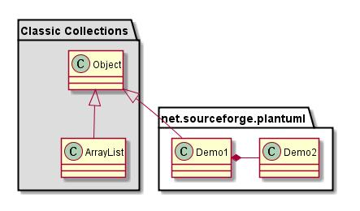

###3.17 包的类型

有不同风格的包。
你指定他们通过设置一个默认的风格通过命令：skinparam packageStyle或者使用一个默认包。

    @startuml
    package foo1 <<Node>> {
    class Class1
    }
    package foo2 <<Rect>> {
    class Class2
    }
    package foo3 <<Folder>> {
    class Class3
    }
    package foo4 <<Frame>> {
    class Class4
    }
    package foo5 <<Cloud>> {
    class Class5
    }
    package foo6 <<Database >> {
    class Class6
    }
    @enduml

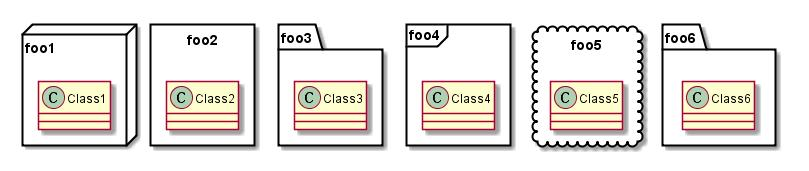

你还可以定义包之间的关系，比如下面的例子：

    @startuml
    skinparam packageStyle rect
    package foo1.foo2 {
    }
    package foo1.foo2.foo3 {
    class Object
    }
    foo1.foo2 +-- foo1.foo2.foo3
    @enduml

###3.18 命名空间

在包中，类名是唯一标识符。这意味着你在不同的包中，你可以有一个相同的名字。
在这种情况下，你应该使用命名空间而不是包。
你可以从其它命名空间引用类的完全限定。类的默认命名空间是描述的起始点。
请注意，你不需要明确的创建命名空间：一个完全限定的类是自动创建正确的命名空间的。

    @startuml
    class BaseClass
    namespace net.dummy #DDDDDD {
    .BaseClass <|-- Person
    Meeting o-- Person
    .BaseClass <|- Meeting
    }
    namespace net.foo {
    net.dummy.Person <|- Person
    .BaseClass <|-- Person
    net.dummy.Meeting o-- Person
    }
    BaseClass <|-- net.unused.Person
    @enduml

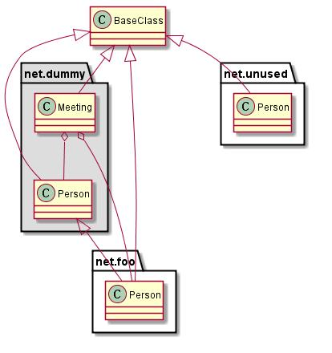

###3.19 自动创建命名空间

你可以定义另一个分隔符(除了点)使用命令：

    @startuml
    set namespaceSeparator ::
    class X1::X2::foo {
    some info
    }
    @enduml

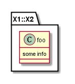

你可以禁止自动创建包，使用命令：set namespaceSeparator none

    @startuml
    set namespaceSeparator none
    class X1.X2.foo {
    some info
    }
    @enduml

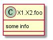

###3.20 棒糖型接口

你还可以定义棒棒糖接口类,使用下面的语法:

    • bar ()- foo
    • bar ()-- foo
    • foo -() bar

    @startuml
    class foo
    bar ()- foo
    @enduml

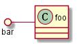

###3.21 改变箭头方向

默认情况下，类之间的联系用 -- 表示，是面向垂直的。但是，是有可能使用水平链接的，通过使用一个破折号(或者点)，像这样：

    @startuml
    Room o- Student
    Room *-- Chair
    @enduml

你也可以通过扭转链接来改变方向：

    @startuml
    Student -o Room
    Chair --* Room
    @enduml

你还可以通过添加 left, right, up or down 来改变关键字内的箭头：

@startuml
foo -left-> dummyLeft
foo -right-> dummyRight
foo -up-> dummyUp
foo -down-> dummyDown
@enduml

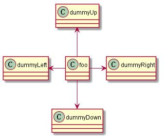

你可以通过只是用缩短箭头方向的第一个字符(例如：-dinstead of -down-)或者两个前字符(-do-)。
请注意，你不应该滥用此功能，Graphviz通常给的结果不要调整。

###3.22 标题图

标题关键字适用于标题。
你可以使用标题和标题关键词较长的标题，就像在序列图中。

    @startuml
    title Simple <b>example </b>\nof title
    Object <|-- ArrayList
    @enduml

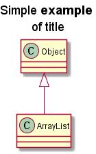

###3.23 说明图

说明图是用来给关键字加上一个说明
你可以选择指定左、右或者居中对齐说明：

    @startuml
    Object <|- ArrayList
    legend right
    <b>Object </b> and <b>ArrayList </b>
    are simple class
    endlegend
    @enduml

###3.24 关联类

你可以定义关联类之后，定义两个类之间的关系，像这个例子：

    @startuml
    class Student {
    Name
    }
    Student "0..*" - "1..*" Course
    (Student , Course) .. Enrollment
    class Enrollment {
    drop()
    cancel()
    }
    @enduml

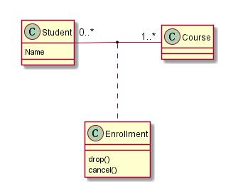

你可以定义在另一个方向上：

    @startuml
    class Student {
    Name
    }
    Student "0..*" -- "1..*" Course
    (Student , Course) . Enrollment
    class Enrollment {
    drop()
    cancel()
    }
    @enduml

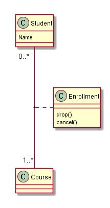

###3.25 Skinparam

你可以使用Skinparam命令来改变图纸的颜色和字体。
你可以使用以下命令：

    • In the diagram definition, like any other commands,
    • In an included file,
    • In a configuration file, provided in the command line or the ANT task.

    @startuml
    skinparam class {
    BackgroundColor PaleGreen
    ArrowColor SeaGreen
    BorderColor SpringGreen
    }
    skinparam stereotypeCBackgroundColor YellowGreen
    Class01 "1" *-- "many" Class02 : contains
    Class03 o-- Class04 : aggregation
    @enduml

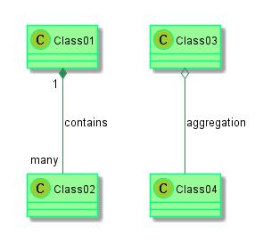

###3.26 Skinned Stereotypes

你可以统一的给类定义特定的颜色和字体。

    @startuml
    skinparam class {
    BackgroundColor PaleGreen
    ArrowColor SeaGreen
    BorderColor SpringGreen
    BackgroundColor <<Foo>> Wheat
    BorderColor <<Foo>> Tomato
    }
    skinparam stereotypeCBackgroundColor YellowGreen
    skinparam stereotypeCBackgroundColor << Foo >> DimGray
    Class01 << Foo >>
    Class01 "1" *-- "many" Class02 : contains
    Class03 <<Foo>> o-- Class04 : aggregation
    @enduml

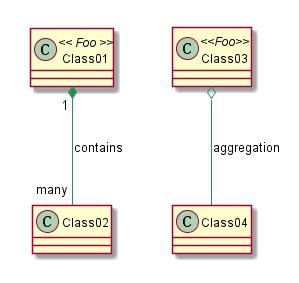

###2.27 颜色渐变

可以自己给类定义颜色或者使用注意符号。
你可以使用标准的颜色名称或者RGB代码。
你可以使用颜色渐变背景，使用以下语法：用以下符号将两种颜色名称分开：

    • | ,
    • /,
    • \,
    • or

根据不同的梯度方向。
例如，你可以：

    @startuml
    skinparam backgroundcolor AntiqueWhite/Gold
    skinparam classBackgroundColor Wheat|CornflowerBlue
    class Foo #red-green
    note left of Foo #blue\9932CC {
    this is my
    note on this class
    }
    package example #GreenYellow/LightGoldenRodYellow {
    class Dummy
    }
    @enduml

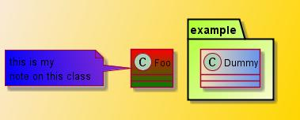

###3.28 分割大文件

有时，你会得到一些非常大的图片文件。
你可以使用 "page (hpages)x(vpages)" 命令将图片分割成几个文件： "happens" 是一个数字，表示横向页面的数量，"vpages" 十一个数字表示垂直页面的数量：

    @startuml
    ' Split into 4 pages
    page 2x2
    class BaseClass
    namespace net.dummy #DDDDDD {
    .BaseClass <|-- Person
    Meeting o-- Person
    .BaseClass <|- Meeting
    }
    namespace net.foo {
    net.dummy.Person <|- Person
    .BaseClass <|-- Person
    net.dummy.Meeting o-- Person
    }
    BaseClass <|-- net.unused.Person
    @enduml

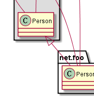

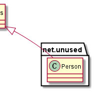

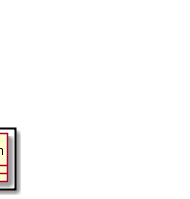

***

Translation of this document is purely personal learning needs, welcome to correct me if there are any inappropriate translation place.

blog : http://0xC000007B.github.io/

Copyright (C) 2014 0xC000007B（mis7xy） <c19930707@gmail.com>

