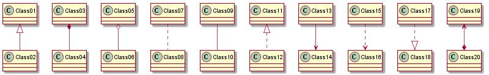
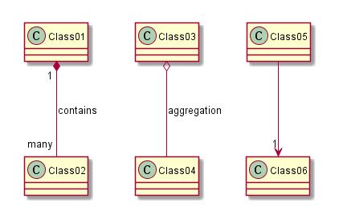
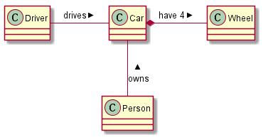
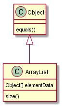
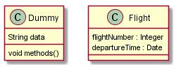
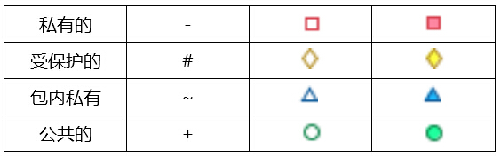
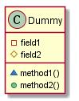
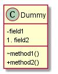
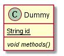

##3 类图

###3.1 类之间的关系

类之间关系是用以下符号定义的：

这里可以用 .. 取代 --
知道这些规则以后，我们可以画出以下类图：

	@startuml
	scale 800 width
	Class01 <|-- Class02
	Class03 *-- Class04
	Class05 o-- Class06
	Class07 .. Class08
	Class09 -- Class10
	Class11 <|.. Class12
	Class13 --> Class14
	Class15 ..> Class16
	Class17 ..|> Class18
	Class19 <--* Class20
	@enduml

###3.2 标签上的关系

可以使用 ":" 紧跟在文本后面，来添加一个标签的关系。
对于输出值，你可以在关系的每一侧用双引号“”标出。

    @startuml
    Class01 "1" *-- "many" Class02 : contains
    Class03 o-- Class04 : aggregation
    Class05 --> "1" Class06
    @enduml

你可以添加一个额外的指向对象的箭头用于描述对象作用于其它对象，这可以通过在描述的开头或者结尾加上 < 或者 > 来实现：

    @startuml
    class Car
    Driver - Car : drives >
    Car *- Wheel : have 4 >
    Car -- Person : < owns
    @enduml

###3.3 添加方法

要声明字段和方法，你可以在字段和方法的名字后面添加 ":" :
系统会通过检查括号来区分字段呵方法。

    @startuml
    Object <|-- ArrayList
    Object : equals()
    ArrayList : Object[] elementData
    ArrayList : size()
    @enduml

你还可以组合 "{}" 之间的字段和方法。
注意关于名字和类型的顺序的语法是高度灵活的。

    @startuml
    class Dummy {
    String data
    void methods()
    }
    class Flight {
    flightNumber : Integer
    departureTime : Date
    }
    @enduml

###3.4 定义可见性

当你要定义方法或者字段的可见性时，你可以使用相应的修饰符：

你可以使用 "skinparam classAttributeIconSize 0" 命令来关掉这些功能：

    @startuml
    skinparam classAttributeIconSize 0
    class Dummy {
    -field1
    #field2
    ~method1()
    +method2()
    }
    @enduml

###3.5 抽象和静态

你可以使用静态和抽象修饰符来定义静态或者抽象字段和方法。
这些修饰符可以在开头或者结尾的时候使用。你可以选择使用分器类而不是静态的。

    @startuml
    class Dummy {
    {static} String id
    {abstract} void methods()
    }
    @enduml

