##4. 活动图
###4.1 简单活动
你可以使用（\*）来标记一个行为的起点和终点。在一些场合，你可以用（\*top）强迫起点在图的顶部。用这样的箭头  - ->

	@startuml
	
	(*) --> "First Activity"
	"First Activity" --> (*)
	
	@enduml
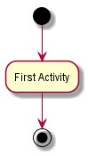

###4.2 标签上的箭头
默认情况下，箭头从上一个行为开始。你可以使用方括号 "[ ]"将标签定义在箭头后。

	@startuml
    
	(*) --> "First Activity"
	-->[You can put also labels] "Second Activity"
	--> (*)
	
	@enduml
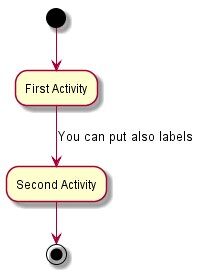

###4.3 改变箭头的方向
你可以使用->水平箭头。可以使用下面箭头的方向的语法：
• -down-> (default arrow)
• -right-> or ->
• -left->
• -up->
	
	@startuml
	
	(*) -up-> "First Activity"
	-right -> "Second Activity"
	--> "Third Activity"
	-left -> (*)
	
	@enduml
	
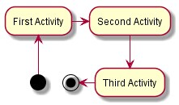

###4.4 分支
你可以使用 if / then / else 关键字定义分支。

	@startuml
	
	(*) --> "Initialization"
	if "Some Test" then
	-->[true] "Some Activity"
	--> "Another activity"
	-right -> (*)
	else
	->[false] "Something else"
	-->[Ending process] (*)
	endif
	
	@enduml
	
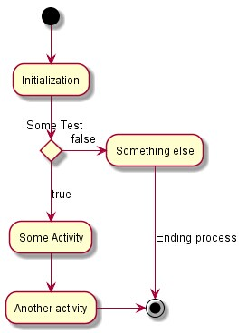

不幸的是，你有时不得不在图文本重复相同的行为：

	@startuml

	(*) --> "check input"
	If "input is verbose" then
	--> [Yes] "turn on verbosity"
	--> "run command"
	else
	--> "run command"
	Endif
	-->(*)

	@enduml
	
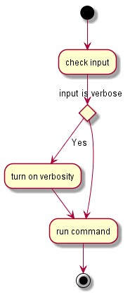

###4.5 多分支
默认情况下，一个分支连接到最后定义的活动，但可以重写它或者用 if 关键字定义一个链接。
它也可以嵌套分支。
	
	@startuml

	(*) --> if "Some Test" then
	-->[true] "activity 1"
	if "" then
	-> "activity 3" as a3
	else
	if "Other test" then
	-left -> "activity 5"
	else
	--> "activity 6"
	endif
	endif
	else
	->[false] "activity 2"
	endif
	a3 --> if "last test" then
	--> "activity 7"
	else
	-> "activity 8"
	endif

	@enduml
	
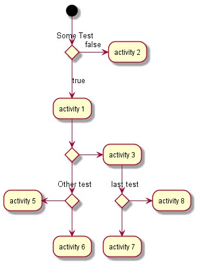

###4.6 同步
你可以使用= = = code = = =显示同步的条。

	@startuml
	
	(*) --> ===B1===
	--> "Parallel Activity 1"
	--> ===B2===
	===B1=== --> "Parallel Activity 2"
	--> ===B2===
	--> (*)
	
	@enduml
	
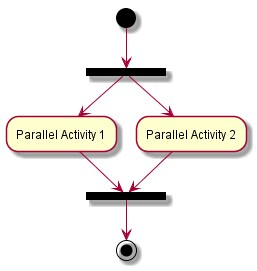
	
	
###4.7 长期活动描述	
当你声明的活动，你可以跨越几行说明文字。你也可在描述中以添加\n。
你可以给出一小段代码用 as 关键字描述活动。这个代码可以用在后面图中的描述。

	@startuml
	
	(*) -left -> "this <size:20>activity </size >
	is <b>very </b> <color:red >long2 </color >
	and defined on several lines
	that contains many <i>text </i>" as A1
	
	-up-> "Another activity\n on several lines"
	
	A1 --> "Short activity "
	
	@enduml
	
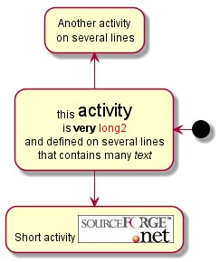
	
###4.8 注释
你可以在一个活动上添加注释，并且可以用命令控制注释出现在你想要做注释的地方。
如果你想把一条注释放在起点，在描述图开始处定义一个注释。
你也可以有几行的注释，用endnote关键字。
	
	@startuml

	(*) --> "Some Activity"
	note right: This activity has to be defined
	"Some Activity" --> (*)
	note left
	This note is on
	several lines
	end note
	
	@enduml
	
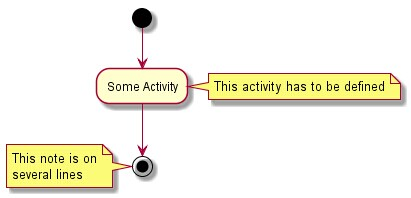

###4.9 分区
你可以使用关键字 partition 定义分区，你也可以为你的分区任选地声明一个背景颜色（使用HTML颜色代码或者名称）。
当你声明几个活动时，他们会自动放进你所使用的分区中。
你可以使用 " } " 来关闭你定义的分区。

	@startuml

	partition Conductor {
	(*) --> "Climbs on Platform"
	--> === S1 ===
	--> Bows
	}
	partition Audience LightSkyBlue {
	=== S1 === --> Applauds
	}
	partition Conductor {
	Bows --> === S2 ===
	--> WavesArmes
	Applauds --> === S2 ===
	}
	partition Orchestra #CCCCEE {
	WavesArmes --> Introduction
	--> "Play music"
	}
	
	@enduml	
	
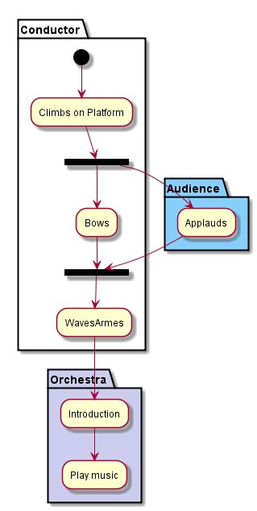
	
###4.10 图的标题
title 关键词是用来给出一个标题的。
你可以使用 title 和 end title 关键字来给出一个长标题，如序列图。

	@startuml

	title Simple example\nof title
	(*) --> "First activity"
	--> (*)

	@enduml
	
	
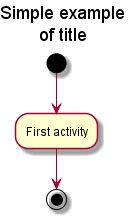
	
	
	
###4.11 Skinparam
你可以使用skinparam命令更改绘图的颜色和字体。
你可以使用此命令：
- 像其他任何命令，在图中定义，
- 在图中包含文件，
- 在一个配置文件中，命令行或Ant任务提供。

你可以为你的活动模板定义特定的颜色和字体。

	
	@startuml

	skinparam backgroundColor #AAFFFF
	skinparam activity {
	StartColor red
	BarColor SaddleBrown
	EndColor Silver
	BackgroundColor Peru
	BackgroundColor << Begin >> Olive
	BorderColor Peru
	FontName Impact
	}
	(*) --> "Climbs on Platform" << Begin >>
	--> === S1 ===
	--> Bows
	--> === S2 ===
	--> WavesArmes
	--> (*)
	
	@enduml
	
	
	
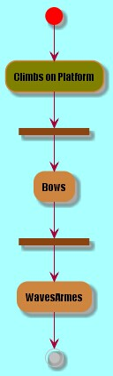

###4.12 八边形
你可以把活动形状改变为八边形，用 skinparam activityShape octagon 命令。

	@startuml
	
	'Default is skinparam activityShape roundBox
	skinparam activityShape octagon
	(*) --> "First Activity"
	"First Activity" --> (*)
	
	@enduml
	
	
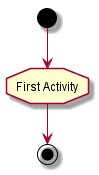

###4.13 完整例子

	@startuml

	title Servlet Container
	(*) --> "ClickServlet.handleRequest ()"
	--> "new Page"
	
	if "Page.onSecurityCheck" then
	->[true] "Page.onInit()"
	
	if "isForward?" then
	->[no] "Process controls"
	
	if "continue processing?" then
	-->[yes] === RENDERING ===
	
	else
	-->[no] === REDIRECT_CHECK ===
	endif
	
	else
	-->[yes] === RENDERING ===
	endif
	
	if "is Post?" then
	-->[yes] "Page.onPost()"
	--> "Page.onRender ()" as render
	--> === REDIRECT_CHECK ===	
	else
	-->[no] "Page.onGet()"
	--> render
	endif
	
	else
	-->[false] === REDIRECT_CHECK ===	
	endif
	
	if "Do redirect?" then
	->[yes] "redirect request"
	--> ==BEFORE_DESTROY ===	
	else
	if "Do Forward?" then
	-left ->[yes] "Forward request"
	--> ==BEFORE_DESTROY ===
	else
	-right ->[no] "Render page template"
	--> ==BEFORE_DESTROY ===
	endif
	endif
	
	--> "Page.onDestroy ()"
	-->(*)

	@enduml	
	
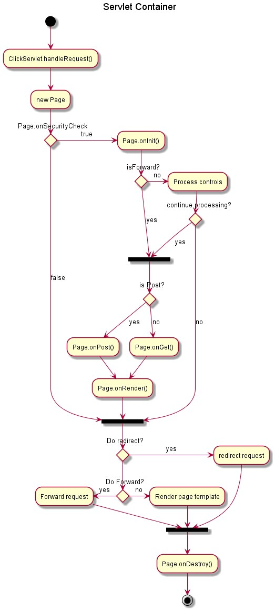
	
	