#5.活动图(测试版)

当前语法活动图有几个局限性和缺点(例如,很难保持).

因此提出了一种全新的语法和实现用户测试版(从V7947),这样我们就可以定义一个更好的格式和语法。

这个新方法的另一个优点是它需要的Graphviz安装(就序列图而言)。

新语法将取代旧的。但是,出于兼容性的原因,旧的语法仍然会被识别,确保提升兼容性。

仅仅是鼓励用户迁移到新的语法。

###5.1简单活动

活动标签:开始和结尾;

文本格式可以通过使用 里奥尔语（creole）维基语法 。

他们通过他们的连接顺序隐形的连接。

     @startuml
	:Hello world;
	:This is on defined on
	several **lines**;
	@enduml

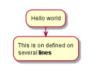

###5.2开始/停止

您可以使用启动和停止的关键词来表示图的开始和结束。

	@startuml
	start
	:Hello world;
	:This is on defined on
	several **lines**;
	stop
	@enduml

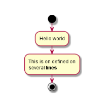

###5.3条件语

您可以使用if,那么else关键字也能来测试你的图。标签可以使用括号。

	@startuml
	start
	if (Graphviz installed?) then (yes)
	:process all\ndiagrams;
	else (no)
	:process only
	__sequence__ and __activity__ diagrams;
	endif
	stop
	@enduml

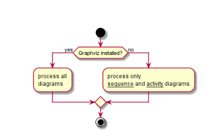

您可以使用elseif关键字进行几个测试:

	@startuml
	start
	if (condition A) then (yes)
	:Text 1;
	elseif (condition B) then (yes)
	:Text 2;
	stop
	elseif (condition C) then (yes)
	:Text 3;
	elseif (condition D) then (yes)
	:Text 4;
	else (nothing)
	:Text else;
	endif
	stop
	@enduml
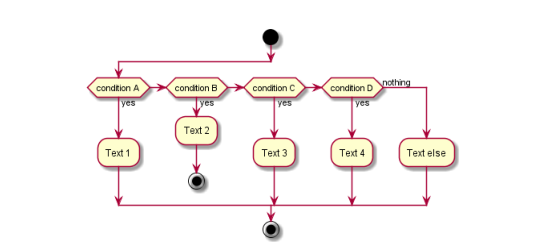
###5.4重复回路（repeat）

您可以使用repeat和repeatwhile关键词重复循环

	@startuml
	start
	repeat
	:read data;
	:generate diagrams;
	repeat while (more data?)
	stop
	@enduml

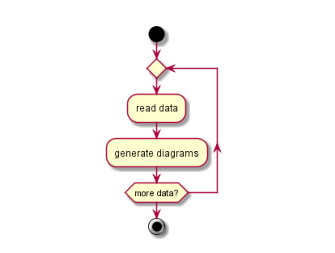

###5.5当型循环（while）

您可以使用while和endwhile关键词重复循环。

	@startuml
	start
	while (data available?)
	:read data;
	:generate diagrams;
	endwhile
	stop
	@enduml

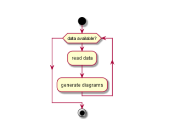

可以提供一个标签endwhile关键字后,或使用is关键字

	@startuml
	while (check filesize ?) is (not empty)
	:read file;
	endwhile (empty)
	:close file;
	@enduml

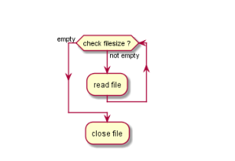

###5.6并行处理

你可以用fork,fork again和endfork关键字表示并行处理。

	@startuml
	start
	if (multiprocessor?) then (yes)
	fork
	:Treatment 1;
	fork again
	:Treatment 2;
	end fork
	else (monoproc)
	:Treatment 1;
	:Treatment 2;
	endif
	@enduml

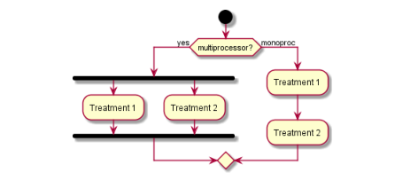
###5.7注释

文本格式可以通过使用克里奥尔语维基语法（creole wiki syntax）。

	@startuml
	start
	:foo1;
	note left: This is a note
	:foo2;
	note right
	This note is on several
	//lines// and can
	contain <b>HTML</b>
	====
	* Calling the method ""foo()"" is prohibited
	end note
	stop
	@enduml

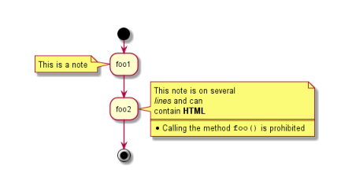
###5.8标题说明

您可以添加标题、页眉、页脚、说明在你的关系图上:

	@startuml
	title this is my title
	if (condition?) then (yes)
	:yes;
	else (no)
	:no;
	note right
	this is a note
	end note
	endif
	stop
	legend
	this is the legend
	endlegend
	footer dummy footer
	header
	this is
	a long __dummy__ header
	end header
	@endum

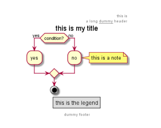
###5.9颜色

您可以使用为一些项目指定一个颜色。

	@startuml
	start
	:starting progress;
	#HotPink:reading configuration files
	These files should edited at this point!;
	#AAAAAA:ending of the process;
	@enduml

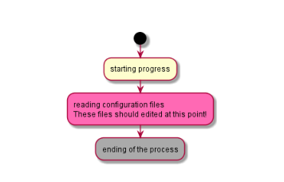
###5.10箭头

使用- >符号,您可以添加文本箭头,改变他们的颜色。

	@startuml
	:foo1;
	-> You can put text on arrows;
	if (test) then
	-[#blue]->
	:foo2;
	-[#green]-> The text can
	also be on several lines
	and **very** long...;
	:foo3;
	else
	-[#black]->
	:foo4;
	endif
	-[#gray]->
	:foo5;
	@enduml

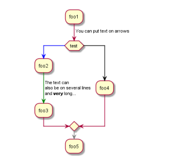
###5.11分类（外层矩形框分类）
你可以将活动分组通过定义分区:

	@startuml
	start
	partition Initialization {
	:read config file;
	:init internal variable;
	}
	partition Running {
	:wait for user interaction;
	:print information;
	}
	stop
	@enduml

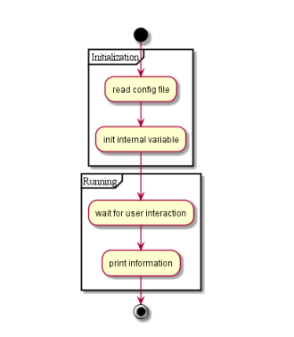

###5.12泳道类型

使用泳道类型,您可以定义泳道属性。它也可以改变泳道的颜色。

	@startuml
	|Swimlane1|
	start
	:foo1;
	|#AntiqueWhite|Swimlane2|
	:foo2;
	:foo3;
	|Swimlane1|
	:foo4;
	|Swimlane2|
	:foo5;
	stop
	@enduml

###5.13Detach关键字
可以删除一个箭头使用detach的关键字。

	@startuml
	:start;
	fork
	:foo1;
	:foo2;
	fork again
	:foo3;
	detach
	endfork
	if (foo4) then
	:foo5;
	detach
	endif
	:foo6;
	detach
	:foo7;
	stop
	@enduml

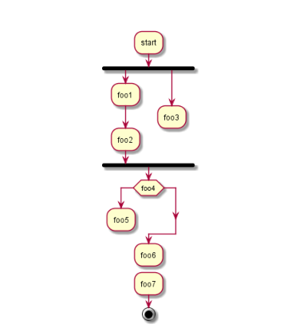
###5.14 SDL

通过改变最终的分离器,您可以设置不同的效果:

	• |
	• <
	• >
	• /
	• ]
	• }
	@startuml
	:Ready;
	:next(o)|
	:Receiving;
	split
	:nak(i)<
	:ack(o)>
	split again
	:ack(i)<
	:next(o)
	on several line|
	:i := i + 1]
	:ack(o)>
    split again
	:err(i)<
	:nak(o)>
	split again
	:foo/
	split again
	:i > 5}
	stop
	end split
	:finish;
	@enduml

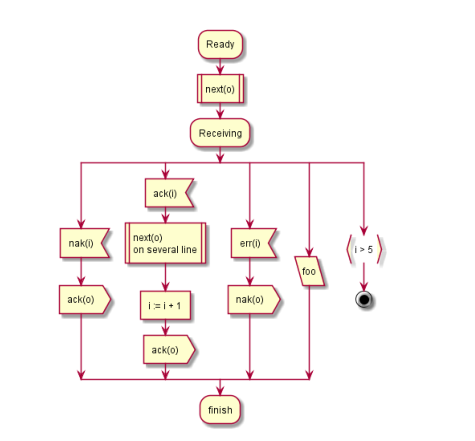
###5.15完整的例子

	@startuml
	start
	:ClickServlet.handleRequest();
	:new page;
	if (Page.onSecurityCheck) then (true)
	:Page.onInit();
	if (isForward?) then (no)
	:Process controls;
	if (continue processing?) then (no)
	stop
	endif
	if (isPost?) then (yes)
	:Page.onPost();
	else (no)
	:Page.onGet();
	endif
	:Page.onRender();
	endif
	else (false)
	endif
	if (do redirect?) then (yes)
	:redirect process;
	else
	if (do forward?) then (yes)
	:Forward request;
	else (no)
	:Render page template;
	endif
	endif
	stop
	@enduml

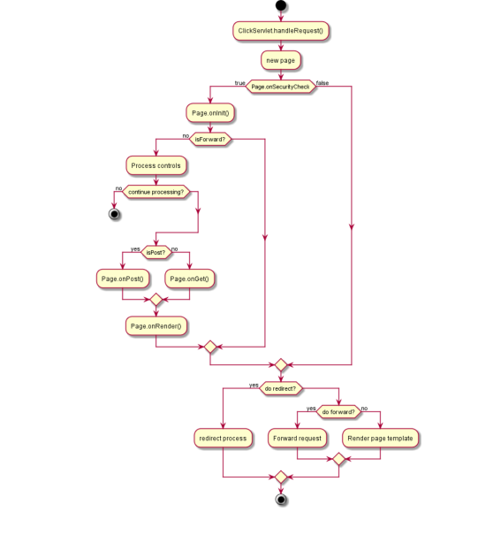