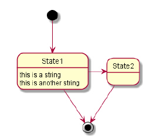
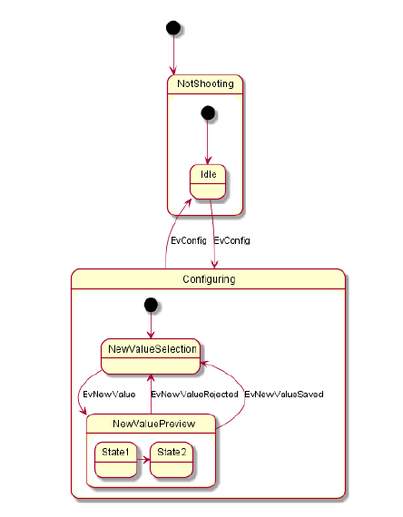
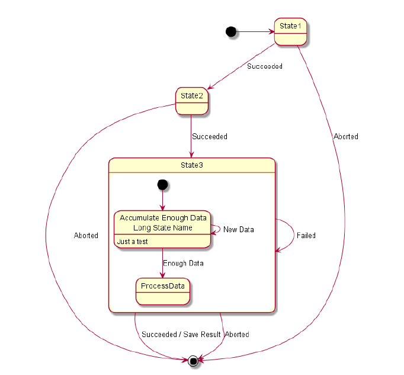
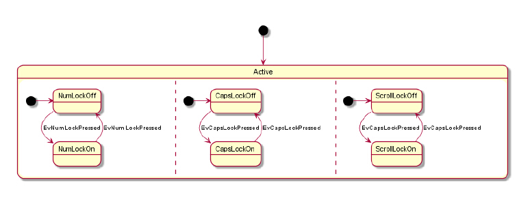
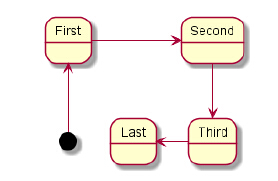
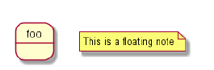
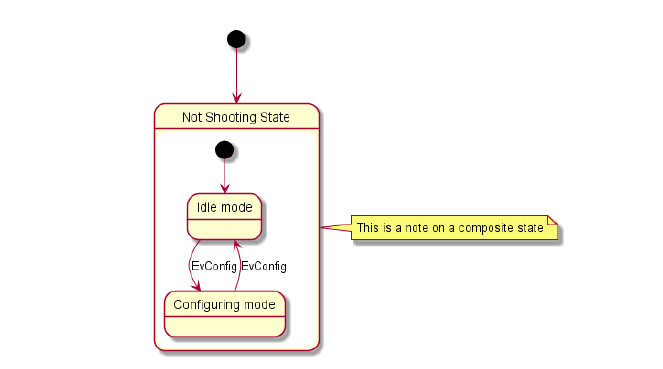
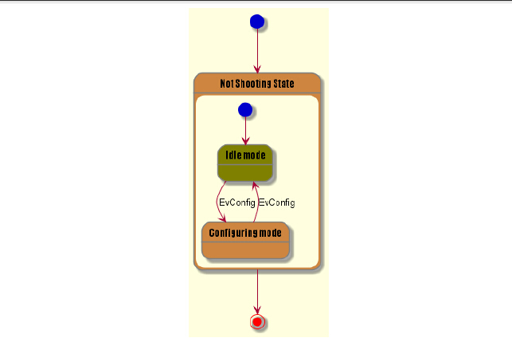

 ##7     State Diagram
 
 ###7.1    Simple State
 
 你可以把[*] 作为状态列表的开始点或者结束点
 
     Use --> for arrows.
    @startuml
    [*] --> State1
    State1 --> [*]
    State1 : this is a string
    State1 : this is another string
    State1 -> State2
    State2 --> [*]
    @enduml

###7.2 Composite state 复合状态

一种状态也可以是复合形式的。你不得不用关键词以及下级分支去阐述它。

    @startuml
    scale 350 width
    [*] --> NotShooting
    state NotShooting {
    [*] --> Idle
    Idle --> Configuring : EvConfig
    Configuring --> Idle : EvConfig
    }
    state Configuring {
    [*] --> NewValueSelection
    NewValueSelection --> NewValuePreview : EvNewValue
    NewValuePreview --> NewValueSelection : EvNewValueRejected
    NewValuePreview --> NewValueSelection : EvNewValueSaved
    state NewValuePreview {
    State1 -> State2
    }
    }
    @enduml

###7.3  Long name 

你也可以用状态关键词去表达过定义状态

    @startuml
    scale 600 width
    [*] -> State1
    State1 --> State2 : Succeeded
    State1 --> [*] : Aborted
    State2 --> State3 : Succeeded
    State2 --> [*] : Aborted
    state State3 {
    state "Accumulate Enough Data\nLong State Name" as long1
    long1 : Just a test
    [*] --> long1
    long1 --> long1 : New Data
    long1 --> ProcessData : Enough Data
    }
    State3 --> State3 : Failed
    State3 --> [*] : Succeeded / Save Result
    State3 --> [*] : Aborted
    @enduml
    

###7.4  Concurrent state 当前状态

你可以用分隔符把当前状态定义成一个复合状态

    @startuml
    scale 800 width
    [*] --> Active
    state Active {
    [*] -> NumLockOff
    NumLockOff --> NumLockOn : EvNumLockPressed
    NumLockOn --> NumLockOff : EvNumLockPressed
    --
    [*] -> CapsLockOff
    CapsLockOff --> CapsLockOn : EvCapsLockPressed
    CapsLockOn --> CapsLockOff : EvCapsLockPressed
    --
    [*] -> ScrollLockOff
    ScrollLockOff --> ScrollLockOn : EvCapsLockPressed
    ScrollLockOn --> ScrollLockOff : EvCapsLockPressed
    }
    @enduml
    

###7.5    Arrow direction 

水平的箭头可能用一下的语法改变箭头的方向
   + -down-> (default arrow)
   + -right-> or ->
   + -left->
   + -up->
   
   
    @startuml
    [*] -up-> First
    First -right -> Second
    Second --> Third
    Third -left -> Last
    @enduml

你可以通过使用表示方向的语法的第一个字母使箭头缩短或者开头两个字母

请记住你不能滥用这些功能,通常给出好的结果 不用做调整

###7.6    Note 

你也可以用左右上下符来定义注释,也可以用几根线条

    @startuml
    [*] --> Active
    Active --> Inactive
    note left of Active : this is a short\nnote
    note right of Inactive
    A note can also
    be defined on
    several lines
    end note
    @enduml
    

也可以有浮动的注释

    @startuml
    state foo
    note "This is a floating note" as N1
    @enduml
    

###7.7    More in notes 

你可以把注释放进复合状态

    [*] --> NotShooting
    state "Not Shooting State" as NotShooting {
    state "Idle mode" as Idle
    state "Configuring mode" as Configuring
    [*] --> Idle
    Idle --> Configuring : EvConfig
    Configuring --> Idle : EvConfig
    }
    note right of NotShooting : This is a note on a composite state
    @enduml
    

###7.8  Skinparam

你可以用skinparam指令去改变图纸的颜色和字体

   + 在图表释义中，像任何其它的指令
   + 在一个包含文件中
   + 在一个配置文件中，假如在指令线或者ANT任务

你可以用传统的状态定义特殊的颜色和字体

    @startuml
    skinparam backgroundColor LightYellow
    skinparam state {
    StartColor MediumBlue
    EndColor Red
    BackgroundColor Peru
    BackgroundColor <<Warning >> Olive
    BorderColor Gray
    FontName Impact
    }
    [*] --> NotShooting
    state "Not Shooting State" as NotShooting {
    state "Idle mode" as Idle <<Warning >>
    state "Configuring mode" as Configuring
    [*] --> Idle
    Idle --> Configuring : EvConfig
    Configuring --> Idle : EvConfig
    }
    NotShooting --> [*]
    @enduml    

