##10.Salt
salt是一个子项目纳入PlantUML,可以帮助你设计的图形界面。
您可以使用@startsalt关键字,或者是@startuml其次是salt关键字。
###10.1基本小部件(Basic widgets)
一个窗口必须用括号开始和结束。然后,您可以定义:
• 按钮使用[and].
• 单选按钮使用(and).
• 检查框使用[and].
• 用户文本区域使用 "
测试代码如下：

	@startuml
	salt
	{
	Just plain text
	[This is my button]
	() Unchecked radio
	(X) Checked radio
	[] Unchecked box
	[X] Checked box
	"Enter text here "
	^This is a droplist^
	}
	@enduml
	
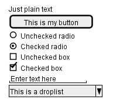

这个工具的目的是讨论简单和样本窗口。

###10.2使用网格（using grid）
一个表是使用一个开括号{时自动创建的。,你必须使用|分隔列。
例如:
测试代码如下：

	@startsalt
	{
	Login | "MyName "
	Password | "**** "
	[Cancel] | [ OK ]
	}
	@endsalt
	
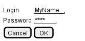

只是打开支架后,您可以使用一个角色定义,如果你想吸引行或列网格的:

	#显示所有垂直和水平线
	!显示所有竖线
	-显示所有水平线
	+显示外部线路
测试代码如下：

	@startsalt
	{+
	Login | "MyName "
	Password | "**** "
	[Cancel] | [ OK ]
	}
	@endsalt
	
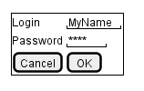

###10.3使用分隔符(Using separator)
您可以使用几个水平线作为分隔符。
测试代码如下：

	@startsalt
	{
	Text1
	..
	"Some field"
	==
	Note on usage
	~~
	Another text
	--
	[Ok]
	}
	@endsalt
	
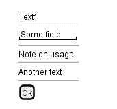

###10.4 Tree小部件（Tree widget）
有一棵树,你必须首先{T 和使用 + 表示层次结构。
测试代码如下：

	@startsalt
	{
	{T
	+ World
	++ America
	+++ Canada
	+++ USA
	++++ New York
	++++ Boston
	+++ Mexico
	++ Europe
	+++ Italy
	+++ Germany
	++++ Berlin
	++ Africa
	}
	}
	@endsalt
	
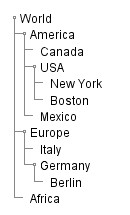

###10.5封闭支架（Enclosing brackets）
您可以定义子元素通过打开一个新的支架。
测试代码如下：

	@startsalt
	{
	Name | " "
	Modifiers: | { (X) public | () default | () private | () protected
	[] abstract | [] final | [] static }
	Superclass: | { "java.lang.Object " | [Browse ...] }
	}
	@endsalt

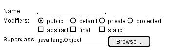

###10.6添加标签（Adding tabs）
您可以添加标签使用{ / 符号。请注意,您可以使用HTML代码粗体文本。
测试代码如下：

	@startsalt
	{+
	{/ <b>General | Fullscreen | Behavior | Saving }
	{{
	Open image in: | ^Smart Mode^ }
	[X] Smooth images when zoomed
	[X] Confirm image deletion
	[ ] Show hidden images
	}[
	Close]
	}
	@endsalt
	
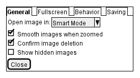

标签也可以垂直面向:
测试代码如下：

	@startsalt
	{+
	{/ <b>General
	Fullscreen
	Behavior
	Saving } |
	{{
	Open image in: | ^Smart Mode^ }
	[X] Smooth images when zoomed
	[X] Confirm image deletion
	[ ] Show hidden images
	[Close]
	}}
	@endsalt
	
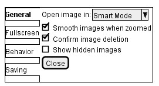

###10.7使用菜单（Using menu）
您可以添加一个菜单通过使用{ *符号。
测试代码如下：

	@startsalt
	{+
	{* File | Edit | Source | Refactor }
	{/ General | Fullscreen | Behavior | Saving }
	{{
	Open image in: | ^Smart Mode^ }
	[X] Smooth images when zoomed
	[X] Confirm image deletion
	[ ] Show hidden images
	}[
	Close]
	}
	@endsalt
	
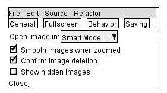

也可以打开一个菜单:
测试代码如下：

	@startsalt
	{+
	{* File | Edit | Source | Refactor
	Refactor | New | Open File | - | Close | Close All }
	{/ General | Fullscreen | Behavior | Saving }
	{{
	Open image in: | ^Smart Mode^ }
	[X] Smooth images when zoomed
	[X] Confirm image deletion
	[ ] Show hidden images
	}[
	Close]
	}
	@endsalt
	
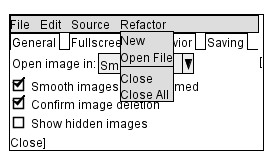

###10.8先进的表（Advanced table）
你可以使用两个特殊的符号为这个表：
+  *表明一个单元格在表格的左边
+ .合并一个单元格

测试代码如下：

	@startsalt
	{#
	. | Column 2 | Column 3
	Row header 1 | value 1 | value 2
	Row header 2 | A long cell | *
	}
	@endsalt
	
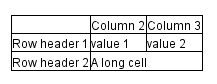

