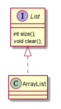
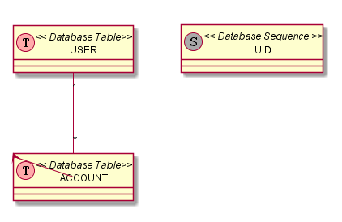
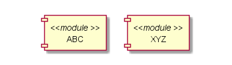
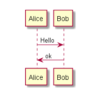
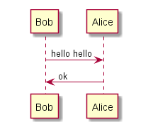
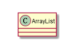
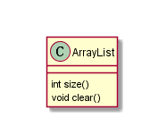
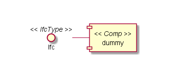
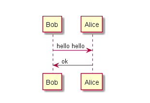
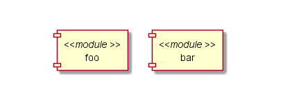

##13.预处理
PlantUML 包含一些辅助的预处理功能, 并且在所有图表中均可使用.它的设计目的与C语言的预处理是非常相似的,只是将C语言中的开头字符(`#`)换成了感叹号标记(`!`).

###13.1 包含文件
使用 `!include` 命令将需要包含的文件加入到您的图表中.
设想一下, 您有很多一样的类出现在不同的图表中. 除了不停的拷贝这部分描述, 我们还可以定义一个文件包含这部分描述, 然后使用它.

	@startuml

	!include List.iuml
	List <|.. ArrayList

	@enduml

其中 **File.iuml:**

	interface List List : int size() List : void clear()

文件 List.iuml 可以被很多图表包含, 并且任何对该文件的修改都会导致所有包含该文件的图表修改.

###13.2 定义常数
你可以定义一个常数使用命令 `!define`. 和C语言相同, 常数的名字只能使用数字, 字母以及下划线, 并且不能以数字开头.

    @startuml

    !define SEQUENCE (S,#AAAAAA) Database Sequence
    !define TABLE (T,#FFAAAA) Database Table
    class USER << TABLE >>
    class ACCOUNT << TABLE >>
    class UID << SEQUENCE >>
    USER "1" -- "*" ACCOUNT
    USER -> UID

    @enduml

当然你可以使用 `!include` 命令定义所有的常量在一个文件中然后将这个文件包含在你的图表中.
可以使用 `!undef XXX` 命令解除对常量的定义.
你还可以在命令行中解释一个常量, 使用 `-D`标志.

	java -jar plantuml.jar -DTITLE="My title" atest1.txt

注意`-D`标志必须放在 `-jar plantuml.jar` 的后面.

###13.3 宏定义
你还可以定义宏的参数

    @startuml

    !define module(x) component x <<module >>
    module(ABC)
    module(XYZ)

    @enduml

宏可以有若干个参数

    @startuml

    !define send(a,b,c) a->b : c
    send(Alice , Bob , Hello)
    send(Bob , Alice , ok)

    @enduml

###13.4 多行宏定义
你还可以定义一个多行宏使用关键字 `!definelong` 和 `!enddefinelong`.

    @startuml

    !define DOUBLE(x) x x
    !definelong AUTHEN(x,y)
    x -> y : DOUBLE(hello)
    y -> x : ok
    !enddefinelong
    AUTHEN(Bob ,Alice)

    @enduml

###13.5 条件
你可以使用 `!ifdef XXX` 和 `!endif` 命令去有条件的绘制.
在这两个命令之间的内容要想被包含, 必须确保被定义在 `!ifdef` 命令之后的常量`XXX` 在之前被定义过.
你还可以准备一个 `!else` 部分, 这部分内容将会在常量没有被定义时被包含.

    @startuml

    !include ArrayList.iuml

    @enduml

**File ArrayList.iuml**

    class ArrayList
    !ifdef SHOW_METHODS
    ArrayList : int size()
    ArrayList : void clear()
    !endif

接着你可以使用`!define` 命令去激活图表的条件.\

    @startuml

    !define SHOW_METHODS
    !include ArrayList.iuml

    @enduml

你还可以使用命令 `!ifndef` 去包含常量没有被定义时的内容.

###13.6 搜索路径
你可以指定 java 属性 "plantuml.include.path" 在命令行中.
比如说:

	java -Dplantuml.include.path="c:/mydir" -jar plantuml.jar atest1.txt

注意 *-D* 选项必须放在 *-jar* 选项之前, 如果*-D* 选项放在了 *-jar* 选项之后将会被用作在 *plantuml* 预处理程序中定义一个常量.

###13.7 高级特性
它可以将文本追加到宏参数的后面, 使用 `##` 语法.

    @startuml

    !definelong COMP_TEXTGENCOMP(name)
    [name] << Comp >>
    interface Ifc << IfcType >> AS name##Ifc
    name##Ifc - [name]
    !enddefinelong
    COMP_TEXTGENCOMP(dummy)

    @enduml

一个宏可以被另一个宏定义.

    @startuml

    !define DOUBLE(x) x x
    !definelong AUTHEN(x,y)
    x -> y : DOUBLE(hello)
    y -> x : ok
    !enddefinelong
    AUTHEN(Bob ,Alice)

    @enduml

宏的参数个数不同可以体现出其的多态性.

    @startuml

    !define module(x) component x <<module >>
    !define module(x,y) component x as y <<module >>
    module(foo)
    module(bar , barcode)

    @enduml

你可以使用系统环境变量或常量定义当需要包含如:

    !include %windir%/test1.txt
    !define PLANTUML_HOME /home/foo
    !include PLANTUML_HOME/test1.txt