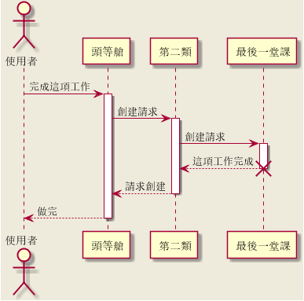

##14.国际化
PlantUML 语言使用*字母*去定义行为者, 用例等等. 但是*字母*并不只是 **A-Z** 拉丁字母, 它还可以是任何语言的文字.

    @startuml

    skinparam backgroundColor #EEEBDC
    actor 使用者
    participant " 頭等艙" as A
    participant " 第二類" as B
    participant " 最後一堂課" as 別的東西
    使用者-> A: 完成這項工作
    activate A
    A -> B: 創建請求
    activate B
    B -> 別的東西: 創建請求
    activate 別的東西
    別的東西--> B: 這項工作完成
    destroy 別的東西
    B --> A: 請求創建
    deactivate B
    A --> 使用者: 做完
    deactivate A

    @enduml

###14.1 字符集
在读取文本文件包含 UML 文本时, 其文本的描述取决于系统使用的默认字符集. 通常情况下, 这不存在影响, 但是在某种特定情况下, 你可能希望使用其他字符集. 比如这行命令

	java -jar plantuml.jar -charset UTF -8 files.txt

或者这个 ant 任务:

	<target name="main">
	<plantuml dir="./src" charset="UTF -8" />
	</target >

根据你的 Java 安装, 应具备以下字符集: *ISO-8859-1, UTF-8, UTF-16BE, UTF-8LE, UTF-16*.
